# Marina Berth Allocation under Realistic Dynamic Demand — Final Report

*Phase 4 of the berth-allocation thesis project. All data, figures and numbers
in this report are produced by the scripts in `experiments/phase4/` and are
fully reproducible (fixed seeds).*

---

## 1. Motivation and questions

Phases 1-3 developed a family of MILP models for assigning boats to berths and
validated them on small synthetic instances where **all requests are known in
advance**. Real marinas do not work like that: booking requests arrive one at
a time over the whole year, decisions must be given promptly, and an accepted
booking cannot be silently undone. This phase answers the three remaining
questions on realistic data:

1. **Scale and realism** — does the approach work on a realistic, large marina
   with a full season of demand?
2. **Dynamic arrivals** — what is lost when requests arrive over time, and how
   should decisions be made (instantly vs in nightly optimization batches)?
3. **Weight tuning** — which objective weights are best, and how does the best
   configuration change with the operating conditions (quiet / normal / record
   season)?

## 2. The realistic dataset

### 2.1 Marina

A synthetic marina of **460 wet berths** in 8 size categories, parameterised
on the published characteristics of large Greek coastal marinas (Alimos, Zea,
Gouvia, Rhodes class): berth mix concentrated in the 8-15 m range, a small
superyacht quay, daily tariffs from ~2 to ~9.5 EUR per metre of boat per day,
shore-power tiers 16A-125A, and a majority of berths held by annual
contracts.

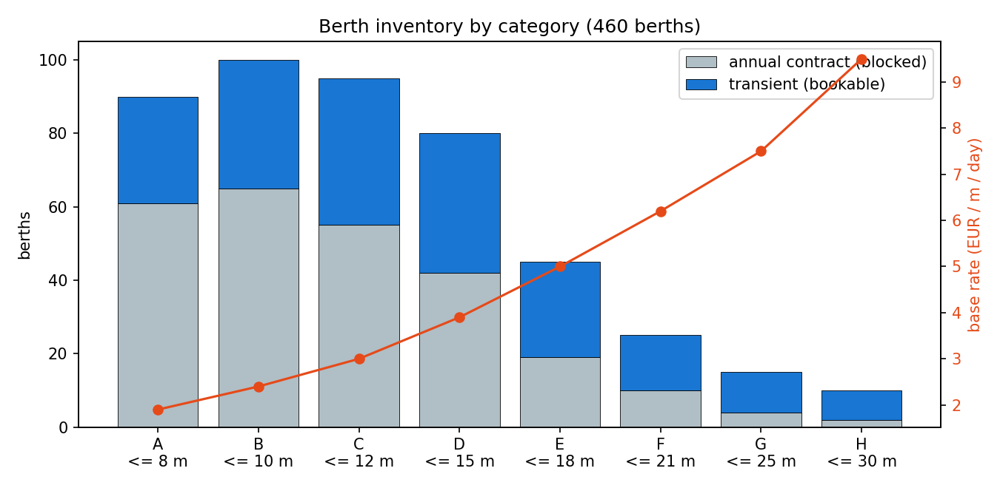

**258 berths (55%) are blocked by annual contracts** (fixed revenue
~1.32 M EUR per season); allocation decisions concern the **202-berth
transient pool**. Sanity check on prices: a 12 m boat in a category-C berth
pays ~36 EUR/day in shoulder season and ~49 EUR/day in August — matching real
Greek tariff sheets.

### 2.2 Booking stream

Season 1 April - 31 October 2025 (214 days). Every request has a **booking
day** (when the marina hears about it) and a **stay window** — requests never
arrive simultaneously. The stream is an inhomogeneous Poisson process with
monthly seasonality and a Friday/Saturday charter-changeover peak; prices are
seasonal (x0.8 low, x1.0 shoulder, x1.35 high season).

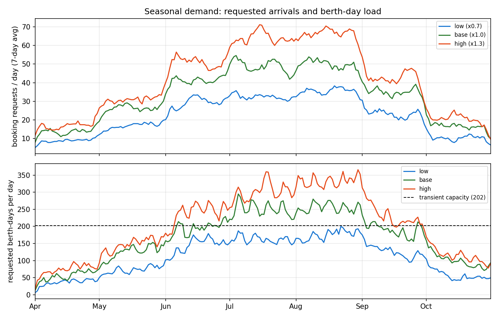

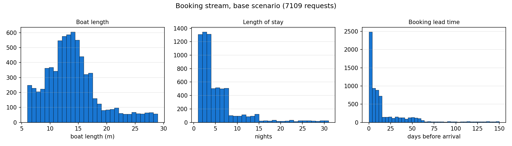

Boat mix: 15% day cruisers (6-9.5 m), 45% sailing cruisers/charter
(9.5-17 m), 30% motor yachts (10-22 m), 10% superyachts (20-29 m), with
size-dependent beam, draft and shore-power needs. Stays are transit-heavy
(median 3 nights, mean ~4.9); 35% of bookings arrive at most 2 days before
arrival (VHF walk-ins), superyachts book months ahead.

Three demand scenarios scale the intensity:

| Scenario | Multiplier | Requests (seed 7) | Peak berth-day demand vs capacity |
|---|---|---|---|
| low  | x0.7 | 4,789 | below capacity all season |
| base | x1.0 | 7,109 | ~116% in July-August |
| high | x1.3 | 8,951 | ~150% in July-August |

## 3. Decision policies

| Policy | Decision timing | Rule |
|---|---|---|
| `online[first_fit]` | instant | first free feasible berth (dock-walk order) |
| `online[best_fit]` | instant | tightest free feasible berth |
| `online[revenue_max]` | instant | highest-rate free feasible berth (myopic) |
| `batch[plain]` | nightly | joint MILP, pure revenue objective |
| `batch[tuned]` | nightly | joint MILP with tuned weights (below) |
| `oracle` | — | clairvoyant bounds (perfect information) |

The batch MILP maximises total **net pair value** over feasible
(berth, request) pairs:

```
net(i, j) = revenue(i, j)
          - space * rate_i * (length_i - length_j) * nights_j     tight packing
          - frag  * rate_i * length_i * dead_gap_days(i, j)       fragmentation
          - opp   * rate_i * length_i * sum_t pressure(t)         opportunity cost
```

subject to one berth per request and no overlapping stays per berth, solved
with HiGHS in milliseconds per nightly batch. A request whose every option has
non-positive net value is **rejected strategically** — with `opp = L`, a boat
is accepted in peak season only if it fills more than fraction `L` of the
berth's revenue potential (a yield-management protection level).

Because the exact clairvoyant MILP (~700k binary pairs) cannot be solved in
reasonable time, the oracle is bracketed by a **category-pooled LP upper
bound** (berths pooled per size category at the category's maximum rate — a
valid, ~4% inflated bound on any policy's revenue) and a **clairvoyant greedy
plan** (perfect-information best-fit by arrival day — a feasible lower bound
on the clairvoyant optimum).

## 4. Weight tuning (which weights are best, in which case)

The three weights and the batching interval were tuned by a staged sweep
(7 space x 6 opp x 4 frag values x 3 batching intervals, 3 scenarios,
2 seeds, ~120 full-season simulations; every run in
`results/phase4/data/tuning_runs.csv`).

### 4.1 Space weight: the knob that matters

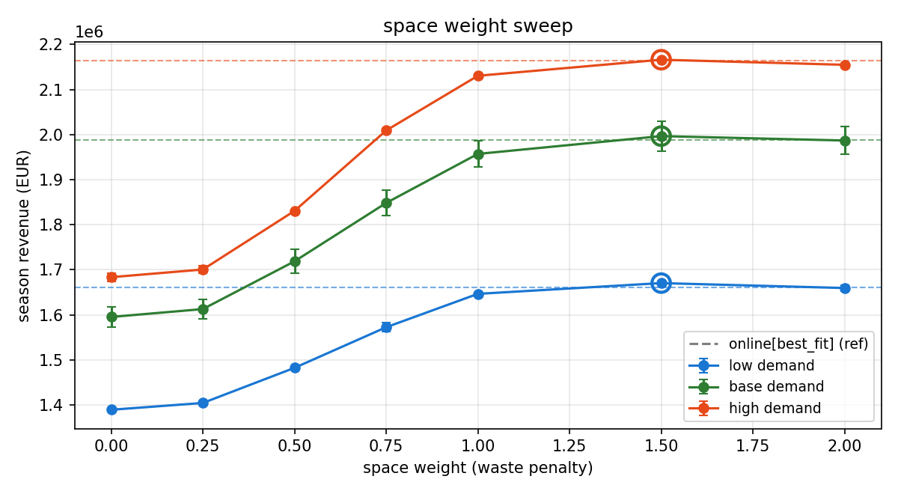

Season revenue as a function of the tight-packing weight (dashed lines =
online best-fit reference; circles = best value):

| Scenario | space = 0 | space = 1.5 | gain |
|---|---|---|---|
| low  | 1,389,434 EUR | 1,670,476 EUR | **+20%** |
| base | 1,595,376 EUR | 1,996,654 EUR | **+25%** |
| high | 1,683,636 EUR | 2,166,167 EUR | **+29%** |

With `space = 0` the MILP behaves like the myopic `revenue_max` rule: every
boat is put in the highest-rate (largest) berth that fits, big berths burn out
early, and later large boats — the most valuable requests — are rejected.
From `space = 1.0` the preference flips to the tightest fitting berth and
revenue plateaus; **1.0-2.0 is a robust plateau in every scenario**, so the
recommendation `space = 1.5` is not a fragile optimum. Notably the gain is
large even in the quiet season, because July-August is close to capacity in
every scenario.

### 4.2 Opportunity cost and fragmentation: keep them at zero

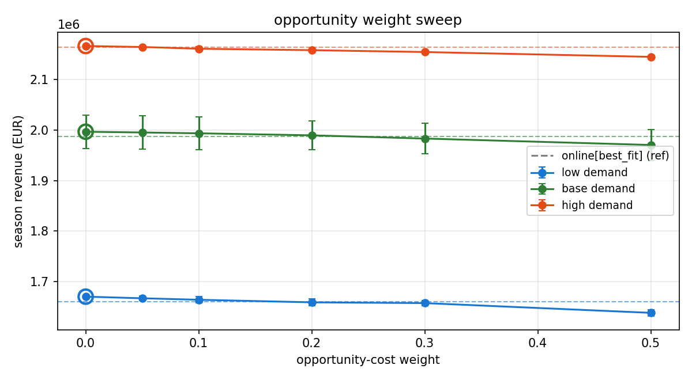

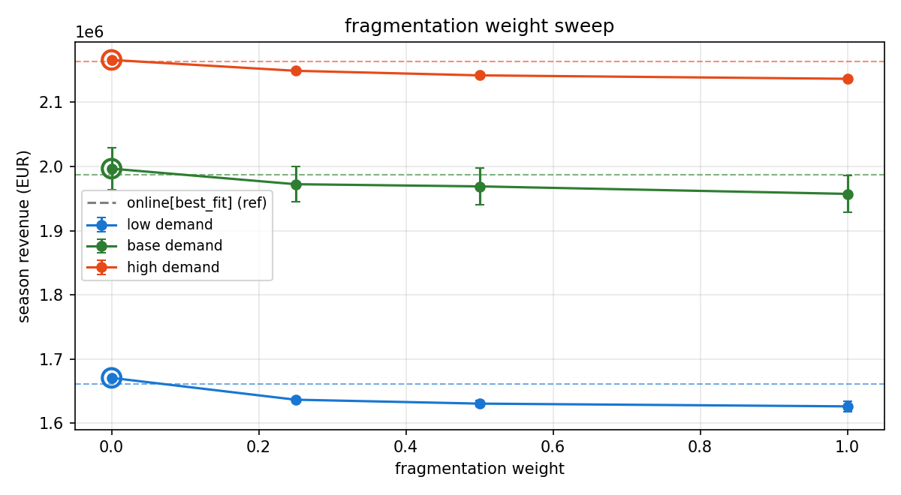

Two clean negative results:

- **Opportunity cost** (strategic rejection of boats that fill little of a
  berth's peak-season revenue potential) is flat to slightly harmful at every
  demand level. Once tight packing is active, large berths are already
  reserved for large boats; additionally rejecting revenue-positive bookings
  only loses money. Yield-management-style protection levels are *not* needed
  in this setting.
- **Fragmentation penalty** (avoiding short stranded gaps) also does not pay:
  the booking stream is transit-heavy, so 1-2 night requests keep arriving
  and fill most short gaps organically.

### 4.3 Batching interval

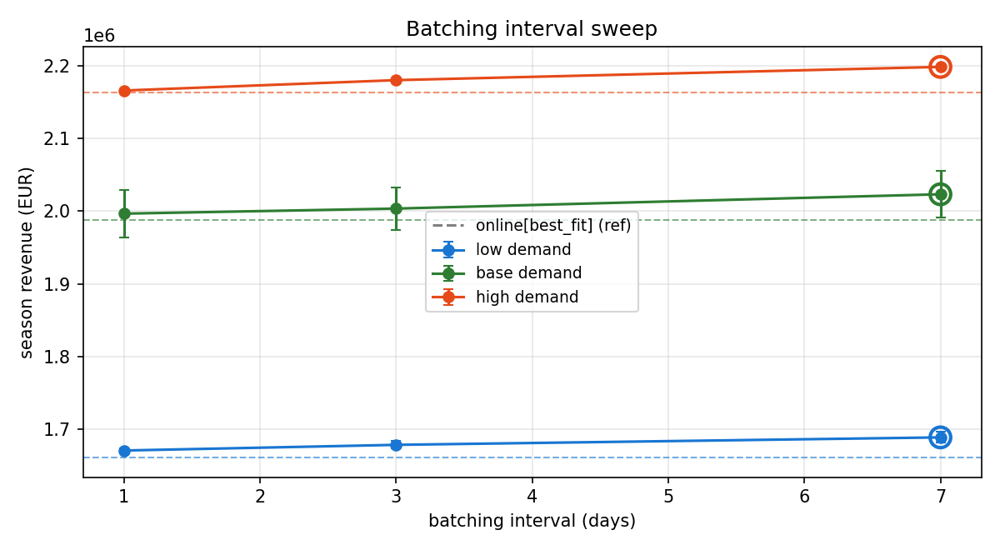

Collecting requests for longer before optimizing raises revenue slightly
(weekly vs nightly: +1.1% low, +1.3% base, +1.5% high) because more requests
are compared jointly. The cost is answering a booking up to a week late,
which real customers would not accept for transit stays; **nightly batching
captures most of the value and keeps same-evening confirmation** (urgent
requests are answered the same evening in all configurations).

### 4.4 Recommended configuration per case

| Operating case | space | frag | opp | batching | Expected effect (vs online best-fit) |
|---|---|---|---|---|---|
| Quiet season (x0.7) | 1.5 | 0 | 0 | nightly (weekly +1.1%) | +0.6-1.7% revenue, ~94% acceptance |
| Normal season (x1.0) | 1.5 | 0 | 0 | nightly (weekly +1.3%) | +0.5-1.8% revenue |
| Record season (x1.3) | 1.5 | 0 | 0 | nightly (weekly +1.5%) | +0.1-1.6% revenue |

The tuned configuration is the same in every scenario — the value of the
batch MILP comes almost entirely from tight packing plus joint optimization,
not from demand-dependent weight switching. This is a practical advantage:
the marina does not need to re-tune the system as demand changes.

## 5. Policy comparison under dynamic arrivals

Full comparison over 3 demand scenarios x 3 request seeds (45 season
simulations; every run in `results/phase4/data/comparison_runs.csv`,
aggregated in `comparison_summary.json`).

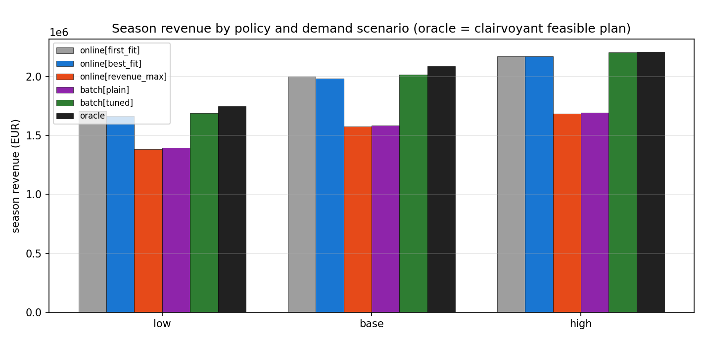

Season revenue, mean +- std over seeds, and the share of the clairvoyant
upper bound (UB; note the UB is inflated ~4% by rate pooling, so the true
perfect-information optimum lies between the "oracle" plan and the UB):

**Base demand** (UB 2,385,710 EUR; clairvoyant plan 2,088,729 = 87.6% of UB)

| Policy | Revenue (EUR) | Acceptance | Occupancy | vs UB |
|---|---|---|---|---|
| online[first_fit] | 1,998,294 +- 29,411 | 83.0% | 63.4% | 83.8% |
| online[best_fit] | 1,981,639 +- 29,102 | 85.8% | 64.5% | 83.1% |
| online[revenue_max] | 1,575,145 +- 23,463 | 68.3% | 51.1% | 66.0% |
| batch[plain] | 1,585,985 +- 22,275 | 68.6% | 51.6% | 66.5% |
| **batch[tuned]** | **2,014,640 +- 28,982** | 84.2% | 65.0% | **84.5%** |

**High demand** (UB 2,528,907; clairvoyant plan 2,208,651 = 87.3%)

| Policy | Revenue (EUR) | Acceptance | vs UB |
|---|---|---|---|
| online[first_fit] | 2,170,773 +- 4,714 | 74.9% | 85.8% |
| online[best_fit] | 2,169,655 +- 8,417 | 77.6% | 85.8% |
| online[revenue_max] | 1,683,443 +- 16,932 | 61.3% | 66.6% |
| batch[plain] | 1,695,321 +- 18,223 | 61.8% | 67.0% |
| **batch[tuned]** | **2,204,501 +- 8,227** | 75.5% | **87.2%** |

**Low demand** (UB 2,025,544; clairvoyant plan 1,746,149 = 86.2%)

| Policy | Revenue (EUR) | Acceptance | vs UB |
|---|---|---|---|
| **online[first_fit]** | **1,706,820 +- 3,253** | 92.9% | **84.3%** |
| online[best_fit] | 1,662,942 +- 4,658 | 95.1% | 82.1% |
| online[revenue_max] | 1,384,170 +- 10,354 | 77.6% | 68.3% |
| batch[plain] | 1,394,028 +- 6,870 | 78.0% | 68.8% |
| batch[tuned] | 1,689,750 +- 6,342 | 94.2% | 83.4% |

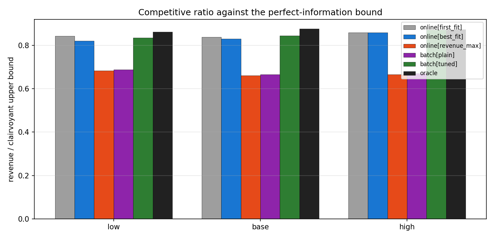

### 5.1 What the comparison shows

1. **Myopic revenue maximisation is a trap.** `online[revenue_max]` and
   `batch[plain]` (the MILP with no weights — mathematically also a
   rate-maximiser) lose **20-25% of season revenue** in every scenario. The
   mechanism is visible in the segment acceptances below: they fill
   expensive large berths with small boats early, and then reject 70% of
   superyachts — the most valuable customers.

   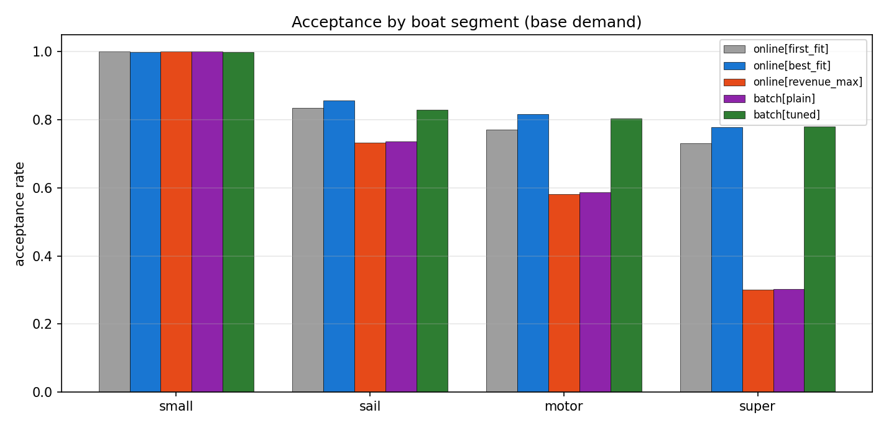

2. **The tuned batch MILP is the best policy whenever capacity binds**
   (base demand: +0.8% vs the best online rule and +1.7% vs best-fit;
   high demand: +1.6%; best in every individual seed), and reaches
   84-87% of the inflated UB —
   i.e. it recovers almost all of the value of perfect information: the
   clairvoyant plan itself only reaches 86-88% of that same UB. The
   remaining gap to the oracle is the genuine price of not knowing future
   requests, about 3.5% of revenue at base demand.

3. **In the quiet season, simple rules suffice.** With slack capacity,
   `online[first_fit]` (mixed dock-walk order) even edges out the tuned MILP
   by ~1%: occasional placement of boats in higher-rate berths pays off when
   it almost never blocks a future large boat. The spread between the three
   sensible policies is only ~2.6% in the low scenario.

4. **Tight packing barely costs acceptance.** `batch[tuned]` accepts 84.2%
   of requests at base demand vs 85.8% for best-fit, while earning more —
   it trades a few marginal small-boat bookings for the large boats that pay
   for them (see the superyacht acceptance in the figure above).

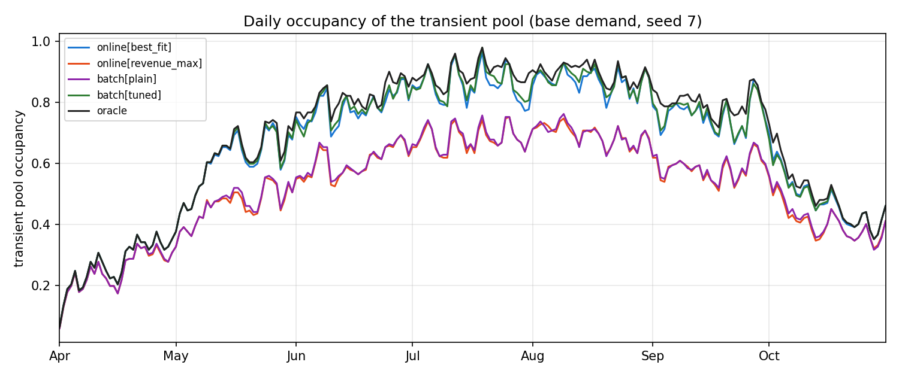

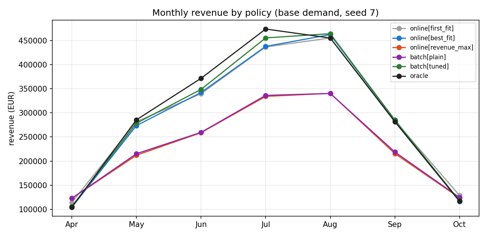

The daily occupancy trace shows `batch[tuned]` (green) hugging the oracle
(black) through the July-August crunch, while the rate-chasing policies
plateau ~15 points lower.

### 5.2 Operational views (screenshots)

Berth-by-day occupancy of the transient pool over the whole season
(white = free, blue = booked), online best-fit vs tuned batch MILP:

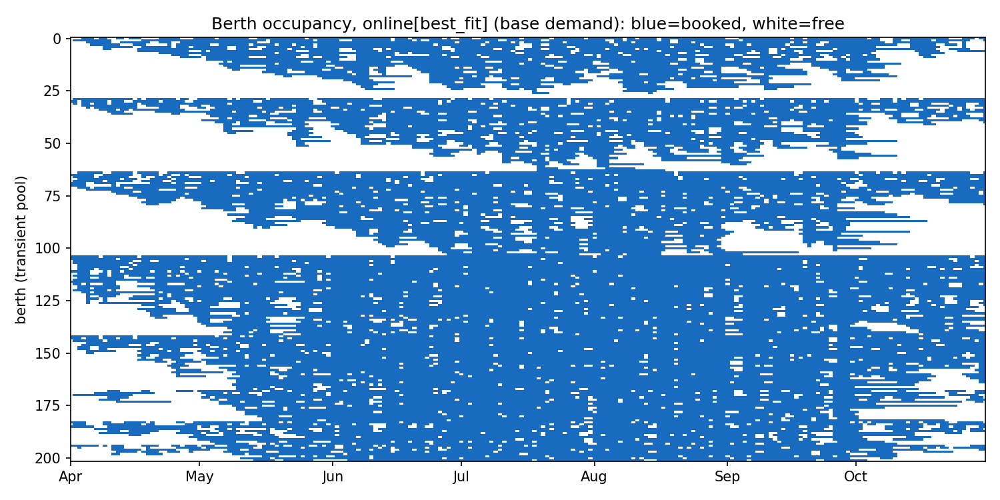

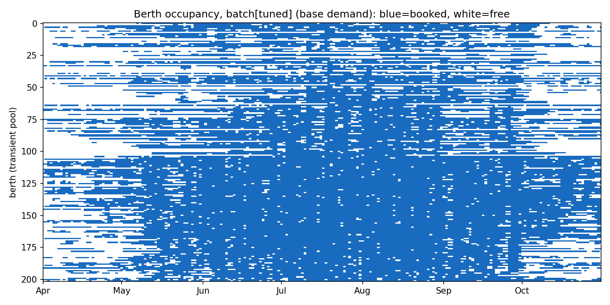

Booking-level Gantt of the superyacht piers (categories G/H) during the
first three weeks of August under the tuned policy — numbers are booking
ids; the piers run essentially full:

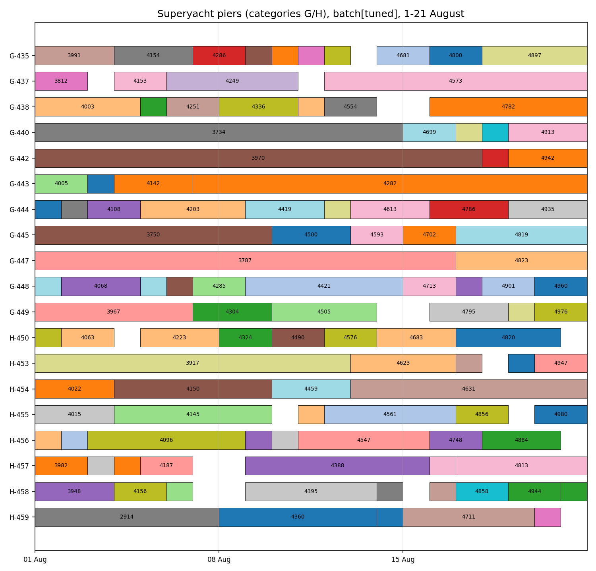

### 5.3 Runtime

A full 214-day season with ~7,100 requests simulates in 4-10 s for online
policies and 8-25 s for the batch MILP (about 200 HiGHS solves of a few
hundred to a few thousand binaries, milliseconds each) on a laptop. The
approach is far faster than real time and deployable as a nightly job.

## 6. Conclusions and recommendations

**Answering the three questions:**

1. **Scale and realism.** The pair-based batch MILP handles a realistic
   460-berth marina with ~7,000 seasonal bookings comfortably: nightly
   optimizations solve in milliseconds and a whole season simulates in
   seconds. The exact full-season MILP is intractable (as expected at ~700k
   binaries), but it is also unnecessary — the operational problem is the
   nightly batch, which is small.

2. **Dynamic arrivals.** Not knowing the future costs surprisingly little
   when the allocation rule is right: the tuned nightly MILP reaches ~96.5%
   of a perfect-information plan's revenue at base demand. Conversely,
   using the *wrong objective* costs 20-25% — an order of magnitude more
   than the value of clairvoyance. In dynamic settings, *how you place*
   matters far more than *how far ahead you see*.

3. **Best weights per case.**

   | Case | Recommended configuration |
   |---|---|
   | Any demand level | space = 1.5 (robust plateau 1.0-2.0), frag = 0, opp = 0 |
   | Quiet season | simple online rules are enough; first-fit is fine |
   | Normal / record season | nightly batch MILP with space = 1.5; weekly batching buys a further ~1.5% if confirmation latency is acceptable |

**Practical recommendation for a marina operator:** run the batch MILP with
the tight-packing weight every night; never place a boat in a berth
materially larger than necessary just because that berth is more expensive;
do not bother with yield-management rejection rules — the packing discipline
already protects premium capacity. The single most damaging policy is the
intuitively appealing "put every customer in the best berth available".

**Threats to validity.** The dataset is synthetic (though carefully
parameterised on Greek marina characteristics); cancellations, no-shows,
weather and multi-marina competition are not modelled; the clairvoyant upper
bound is ~4% loose. These caveats affect absolute revenue numbers far more
than the policy *ranking*, which is stable across all seeds and scenarios
tested.

## Appendix A. Reproducing everything

```bash
pip install -r requirements.txt
python -X utf8 experiments/phase4/make_dataset.py            # datasets + d*.png
python -X utf8 experiments/phase4/tune_weights.py            # sweeps + t*.png
python -X utf8 experiments/phase4/run_dynamic_simulation.py  # comparison + c*.png
```

Raw data: `data/realistic/*.csv` (berth inventory and request streams),
`results/phase4/data/*.csv|json` (every experiment run and summary).

## Appendix B. Modelling simplifications

- stern-to mooring, one boat per berth (alongside mooring and multi-berth
  spanning were studied in Phase 3 on small instances);
- no cancellations or no-shows;
- accepted bookings are never relocated (Phase 2/3 showed stable assignments
  cost little revenue and relocation is operationally disliked);
- contract berths blocked all season; contract revenue treated as fixed.
